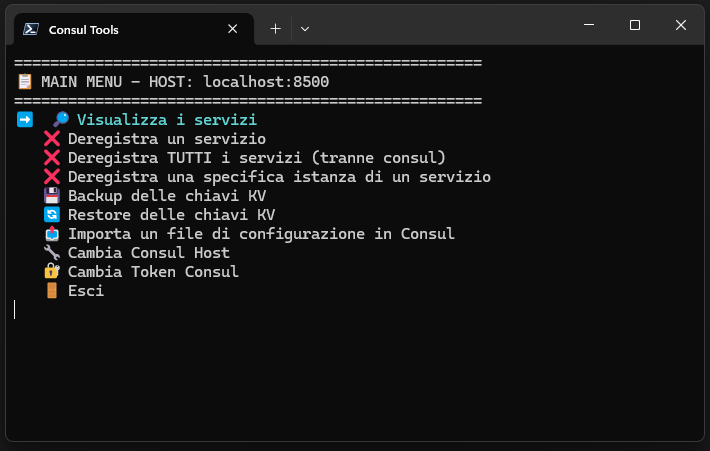

# Consul Tools - PowerShell Script




## 📖 Introduzione

Consul Tools è uno script interattivo scritto in **PowerShell** che
permette di gestire in maniera semplice e veloce un cluster **HashiCorp
Consul**.
Fornisce un menu testuale con navigazione tramite **frecce della
tastiera** e include funzionalità utili come la deregistrazione dei
servizi, la gestione del KV store, il backup/restore delle chiavi e
l'importazione di configurazioni da file `.properties` o `.yml`.

------------------------------------------------------------------------

## ✅ Requisiti

-   **PowerShell 7.0 o superiore**
    -   Necessario per il supporto a `System.Windows.Forms` e alle API
        utilizzate.
    -   Testato su Windows (non funziona su Linux/Mac a causa della
        dipendenza dalle Windows Forms).
-   Un cluster **Consul** raggiungibile via HTTP (default:
    `localhost:8500`).
-   Eventuale **token ACL** di Consul (in caso di cluster protetto).

------------------------------------------------------------------------

## ⚙️ Funzionalità principali

### 🔎 Visualizzazione dei servizi

-   Recupera e mostra tutti i servizi registrati in Consul.
-   Elenca le istanze con dettagli su **ID, nodo, indirizzo e porta**.

### ❌ Deregistrazione dei servizi

-   Deregistra **un singolo servizio** selezionato dal menu.
-   Possibilità di rimuovere **tutte le istanze di un servizio**.
-   Funzione dedicata per la **deregistrazione di tutte le istanze
    tranne `consul`**.

### ❌ Deregistrazione di una singola istanza

-   Permette di scegliere **una specifica istanza** di un servizio e
    deregistrarla, senza toccare le altre.

### 💾 Backup delle chiavi KV

-   Salva tutte le chiavi e i valori presenti nel KV store di Consul.
-   I valori vengono **decodificati da Base64** e salvati in un file
    JSON leggibile.
-   Dialog box per scegliere dove salvare il backup.

### 🔄 Restore delle chiavi KV

-   Ripristina i dati da un file JSON precedentemente salvato.
-   Opzione per **cancellare tutte le chiavi esistenti** prima del
    restore.
-   Dialog box per scegliere il file da importare.

### 📤 Importazione configurazioni

-   Importa un file `.properties` o `.yml` direttamente nel KV store.
-   La configurazione viene salvata in Consul sotto il path:
    `config/<nome-file>/data`
-   Supporta sia **Properties** (convertiti in formato chiave=valore)
    che **YAML** (caricato come testo grezzo).

### 🔧 Gestione connessione a Consul

-   Cambia **host** Consul a cui connettersi.
-   Test automatico della connessione e validazione.
-   Possibilità di aggiornare il **token ACL** al cambio host.

### 🔐 Gestione token

-   Permette di aggiornare manualmente il token ACL di Consul in uso.

### 🚪 Menu interattivo

-   Navigazione tramite **frecce direzionali e INVIO**.
-   Interfaccia chiara e organizzata in un menu principale con tutte le
    opzioni.

------------------------------------------------------------------------

## ▶️ Avvio dello script

1.  Scaricare il file `ConsulTools.ps1`.

2.  Aprire PowerShell 7+ come amministratore.

3.  Eseguire lo script:

    ``` powershell
    ./ConsulTools.ps1
    ```

------------------------------------------------------------------------

## 📋 Menu principale

Il menu iniziale mostra le seguenti opzioni:

1.  🔎 Visualizza i servizi
2.  ❌ Deregistra un servizio
3.  ❌ Deregistra TUTTI i servizi (tranne consul)
4.  ❌ Deregistra una specifica istanza di un servizio
5.  💾 Backup delle chiavi KV
6.  🔄 Restore delle chiavi KV
7.  📤 Importa un file di configurazione in Consul
8.  🔧 Cambia Consul Host
9.  🔐 Cambia Token Consul
10. 🚪 Esci

------------------------------------------------------------------------

## 📌 Note importanti

-   Alcune funzioni richiedono **permessi ACL** adeguati (token con
    privilegi di scrittura).
-   Lo script utilizza sia le API `agent` che `catalog` per deregistrare
    le istanze, garantendo la rimozione completa.\
-   Compatibile solo con **Windows** per via di `System.Windows.Forms`.

------------------------------------------------------------------------

## 📝 Licenza

Rilasciato sotto licenza GPL-3.0 license.
Contributi e miglioramenti sono benvenuti! 🚀
